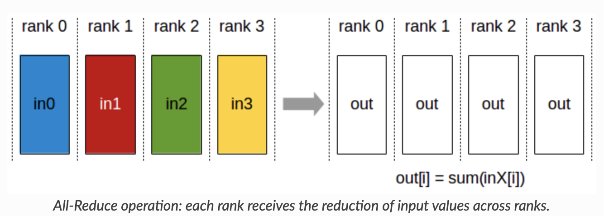

# triton-kernel-tensor-parallel

Two ground-up systems exercises from behind transformer training and serving: a
fused GPU matmul kernel written in Triton, and the tensor/data-parallel
communication layer built directly on MPI.

## Part 1 — Fused matmul + add + ReLU kernel (Triton)

`matmul_relu_kernel.py` computes `D = ReLU(A·B + C)` for fp16 inputs with an fp32
accumulator, as a single fused Triton kernel (A is M×K, B is K×N, C and D are
M×N). It walks the standard GPU-matmul optimization ladder:

- tile assignment — each program instance owns one output tile
- shared-memory tiling with cooperative fetching of A and B sub-tiles
- register-tiled accumulation
- operator fusion — the add of C and the ReLU happen in registers before a single
  write-back, so there is no extra global-memory round trip
- a small launch-config search over block sizes, `num_warps`, and `num_stages`

Measured on the course A10 grader at M=N=K=2048, fp16: **0.248 ms vs. 0.331 ms for
the PyTorch reference — about 1.33× faster** (best of the swept configs).

```bash
python local_test.py matmul_relu_kernel.py   # needs a local CUDA GPU
```

## Part 2 — Tensor- and data-parallel communication (MPI)

The rest implements, from scratch, the collective-communication layer that 2-D
parallel transformer training rides on — no NCCL, just `mpi4py` and NumPy.

- **Custom collectives** (`mpi_wrapper/comm.py`): `myAllreduce` and `myAlltoall`
  built only from point-to-point sends and receives.
  `docs/collectives_discussion.md` explains why the naive
  reduce-to-root-then-broadcast is slower than MPI's ring / recursive-halving
  built-ins.
- **Data-parallel split** (`data/data_parallel_preprocess.py`): shard a batch
  across data-parallel groups while replicating it within each model-parallel
  group.
- **Tensor-model-parallel layer** (`model/func_impl.py`): shard the four attention
  projections across ranks (Q/K/V along the output dimension, O along the input
  dimension) and implement the matching forward and backward communication —
  all-gather to reconstruct the input, all-reduce to combine partial outputs, and
  reduce-scatter on the backward gradient.

<p align="center"></p>

## Run

```bash
pip install -r requirements.txt
mpiexec -n 8 python mpi_demo.py                                   # collectives warm-up
mpiexec -n 8 python -m pytest --with-mpi tests/test_get_info.py   # tensor-parallel layout
mpiexec -n 4 python -m pytest --with-mpi tests/test_transformer_forward.py
```

Use `mpirun` on Linux/macOS and `mpiexec` on Windows (MS-MPI). Add
`--oversubscribe` if you have fewer physical cores than ranks.

## Layout

```
matmul_relu_kernel.py   fused fp16 matmul + add + ReLU Triton kernel + config search
local_test.py           local CUDA correctness/speed harness for the kernel
mpi_wrapper/comm.py      custom myAllreduce / myAlltoall over point-to-point
model/func_impl.py       tensor-parallel sharding + forward/backward comms
data/                    data-parallel batch split
mpi_demo.py              MPI collectives warm-up demos
tests/                   correctness tests (MPI-aware)
docs/                    custom-vs-builtin collectives timing discussion
figs/                    collective-operation diagrams
```

---

Coursework for CSE 291 / DSC 291 (Machine Learning Systems), UC San Diego.
